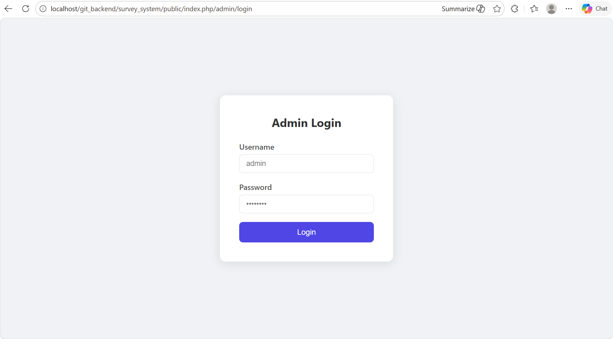
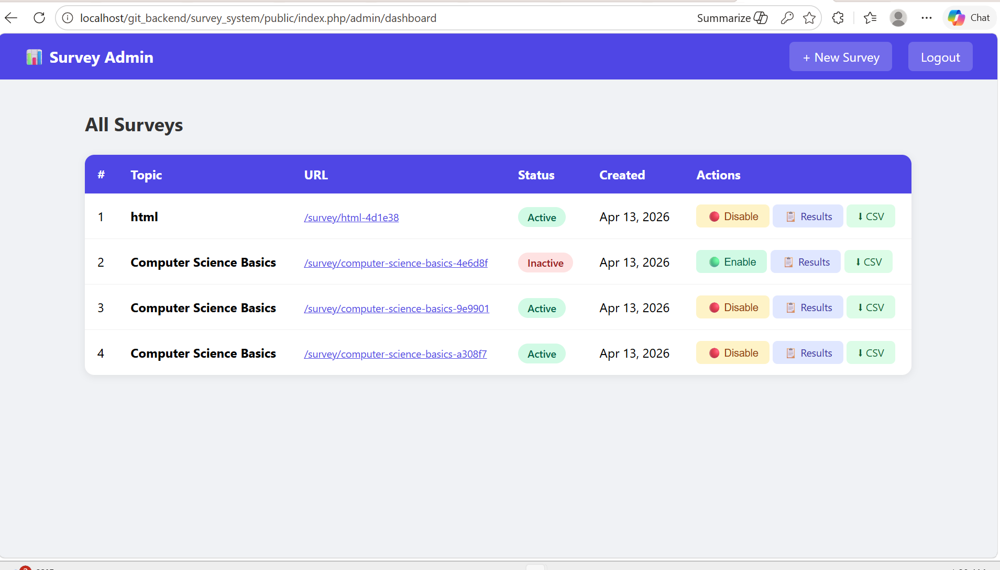
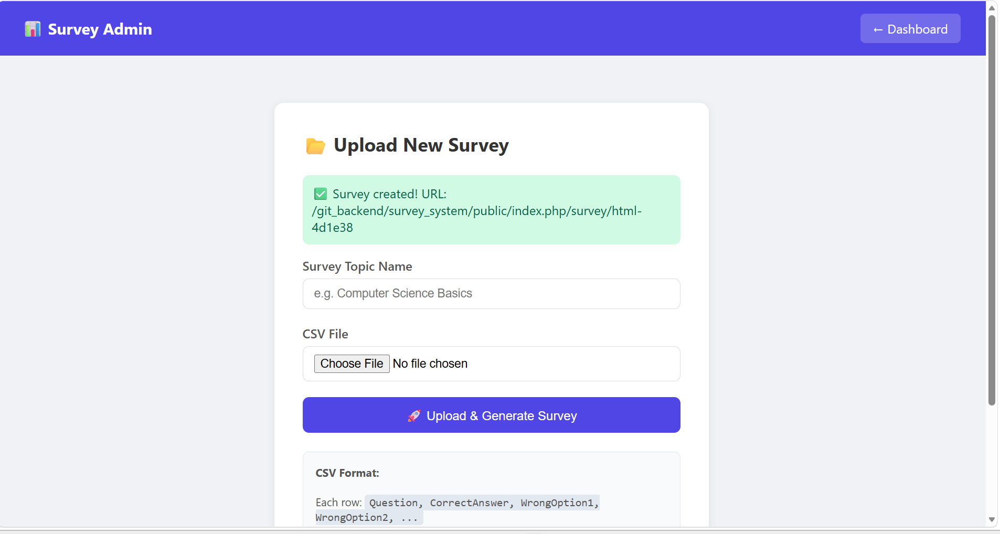
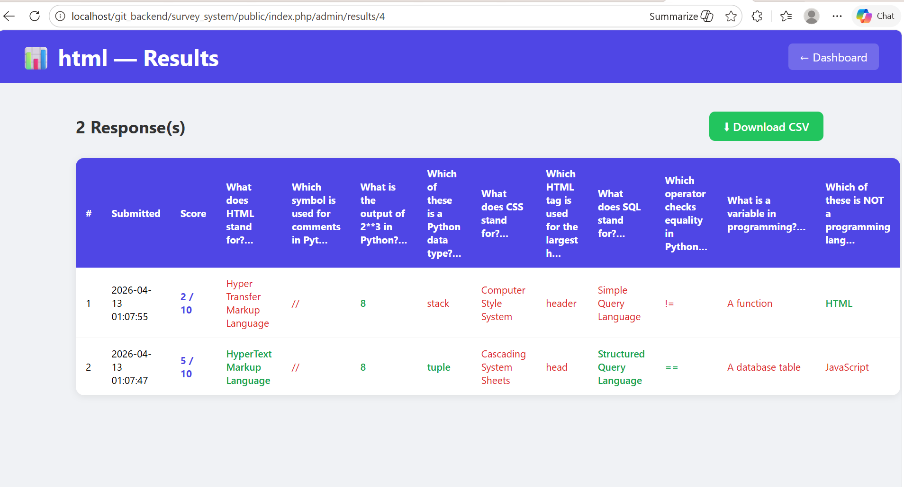

# 📊 Anonymous Survey System

A web-based anonymous survey system built with PHP (Slim Framework 4). Admins can upload CSV files to generate dynamic questionnaires with unique URLs. Participants can access and answer surveys without any login required.

---

## 🚀 Features

- **Admin Dashboard** — Secure login-protected dashboard for managing surveys
- **CSV Upload** — Upload a CSV file to automatically generate a questionnaire
- **Unique Survey URLs** — Each survey gets its own unique shareable URL
- **Enable/Disable Surveys** — Admins can turn survey URLs on or off at any time
- **Anonymous Responses** — Users can answer surveys without logging in
- **Score Calculation** — Automatically calculates and displays the user's score
- **Results Viewer** — Admins can view all responses with scores
- **Download Results** — Export survey results as a CSV file

---

## 🛠️ Tech Stack

| Layer | Technology |
|---|---|
| Framework | Slim Framework 4 |
| Language | PHP 8.2 |
| Database | MySQL (via XAMPP) |
| Templating | Twig |
| Server | Apache (via XAMPP) |
| Package Manager | Composer |

---

## 📋 Prerequisites

Before you begin, make sure you have the following installed:

- [XAMPP](https://www.apachefriends.org/) (Apache + MySQL + PHP 8.2)
- [Composer](https://getcomposer.org/)
- [VS Code](https://code.visualstudio.com/) or any code editor
- [Git](https://git-scm.com/)

---

## ⚙️ Installation Guide

### Step 1: Clone the Repository

```bash
git clone https://github.com/YOUR_USERNAME/survey-system.git
```

Move the project into your XAMPP htdocs folder:

```
C:\xampp\htdocs\git_backend\survey_system
```

### Step 2: Install Dependencies

Open a terminal in the project root and run:

```bash
composer install
```

### Step 3: Configure Environment

Create a `.env` file in the project root:

```env
DB_HOST=localhost
DB_NAME=survey_db
DB_USER=root
DB_PASS=
APP_SECRET=your_secret_key_here
```

### Step 4: Set Up the Database

1. Open phpMyAdmin at `http://localhost/phpmyadmin`
2. Create a new database called `survey_db`
3. Click the **SQL** tab and run the following:

```sql
CREATE DATABASE IF NOT EXISTS survey_db;
USE survey_db;

CREATE TABLE admins (
    id INT AUTO_INCREMENT PRIMARY KEY,
    username VARCHAR(100) NOT NULL UNIQUE,
    password VARCHAR(255) NOT NULL,
    created_at TIMESTAMP DEFAULT CURRENT_TIMESTAMP
);

CREATE TABLE surveys (
    id INT AUTO_INCREMENT PRIMARY KEY,
    topic_name VARCHAR(255) NOT NULL,
    unique_slug VARCHAR(100) NOT NULL UNIQUE,
    is_active TINYINT(1) DEFAULT 1,
    created_at TIMESTAMP DEFAULT CURRENT_TIMESTAMP
);

CREATE TABLE questions (
    id INT AUTO_INCREMENT PRIMARY KEY,
    survey_id INT NOT NULL,
    question_text TEXT NOT NULL,
    correct_answer VARCHAR(255) NOT NULL,
    wrong_options JSON NOT NULL,
    FOREIGN KEY (survey_id) REFERENCES surveys(id) ON DELETE CASCADE
);

CREATE TABLE responses (
    id INT AUTO_INCREMENT PRIMARY KEY,
    survey_id INT NOT NULL,
    answers JSON NOT NULL,
    score INT DEFAULT 0,
    submitted_at TIMESTAMP DEFAULT CURRENT_TIMESTAMP,
    FOREIGN KEY (survey_id) REFERENCES surveys(id) ON DELETE CASCADE
);

-- Default admin account (password: password)
INSERT INTO admins (username, password)
VALUES ('admin', '$2y$10$92IXUNpkjO0rOQ5byMi.Ye4oKoEa3Ro9llC/.og/at2.uheWG/igi');
```

### Step 5: Configure Apache

1. Open `C:\xampp\apache\conf\httpd.conf`
2. Find `<Directory "C:/xampp/htdocs">` and make sure it has:
```apache
AllowOverride All
```
3. Restart Apache in XAMPP Control Panel

### Step 6: Access the Application

Open your browser and go to:

```
http://localhost/git_backend/survey_system/public/index.php/admin/login
```

**Default Admin Credentials:**
| Field | Value |
|---|---|
| Username | `admin` |
| Password | `password` |

---

## 📁 Project Structure

```
survey_system/
├── public/
│   ├── index.php          # Application entry point
│   └── .htaccess          # Apache rewrite rules
├── src/
│   ├── Controllers/
│   │   ├── AdminController.php    # Dashboard, upload, results
│   │   ├── AuthController.php     # Login, logout
│   │   └── SurveyController.php   # Survey display, submission
│   └── Middleware/
│       └── AuthMiddleware.php     # Protects admin routes
├── templates/
│   ├── admin/
│   │   ├── dashboard.twig   # Admin dashboard
│   │   ├── login.twig       # Login page
│   │   ├── upload.twig      # CSV upload page
│   │   └── results.twig     # Survey results page
│   └── survey/
│       └── questionnaire.twig  # Public survey page
├── uploads/               # Uploaded CSV files
├── vendor/                # Composer dependencies
├── .env                   # Environment configuration
├── .htaccess              # Root rewrite rules
└── composer.json          # Project dependencies
```

---

## 📄 CSV Format

Each row in the CSV file must follow this format:

```
Question, CorrectAnswer, WrongOption1, WrongOption2, WrongOption3...
```

**Example:**
```csv
What does HTML stand for?,HyperText Markup Language,High Tech Modern Language,HyperText Modern Links
Which symbol is used for comments in Python?,#,//,/* */,--
What does CSS stand for?,Cascading Style Sheets,Computer Style System,Creative Style Sheets
```

**Rules:**
- First column → Question text
- Second column → Correct answer
- Remaining columns → Wrong options (at least 1 required)

---

## 👤 Usage

### For Admins:
1. Login at `/admin/login`
2. Click **+ New Survey** to upload a CSV
3. Enter a topic name and upload your CSV file
4. Copy the generated survey URL and share it with participants
5. Enable or disable the survey from the dashboard
6. View responses and download results as CSV

### For Users:
1. Open the survey URL shared by the admin
2. Answer all questions
3. Click **Submit Answers**
4. View your score instantly — no login required!

---

## 🔒 Security

- Admin routes are protected by session-based authentication
- Passwords are hashed using PHP's `password_hash()` with bcrypt
- Users cannot access admin pages without logging in
- Survey responses are completely anonymous

---

## 📸 Screenshots

### Admin Login


### Admin Dashboard


### Survey Page


### Results Page


---

## 🤝 Contributing

1. Fork the repository
2. Create a new branch: `git checkout -b feature/your-feature`
3. Commit your changes: `git commit -m 'Add some feature'`
4. Push to the branch: `git push origin feature/your-feature`
5. Open a Pull Request

---

## 📝 License

This project is open source and available under the [MIT License](LICENSE).

---

## 👨‍💻 Author

Built with ❤️ using Slim Framework 4 and PHP.
